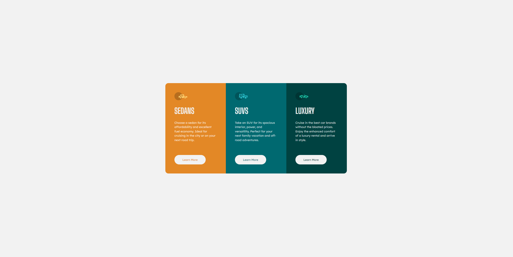

<h1 align="center">3 Column Challenge</h1>

  This is a developmental project that I located on frontendmenton.io. At this point in my journey, I'm mastering JavaScript and React.js. I'm completing these "mini" projects to keep my HTML & CSS sharp.
  
This was a challenge to replicate a simple one page website with a plain background and a container that holds three cards with text areas and icons. A mobile optimization was included.  I completed this project with relative ease.
If there are any suggestions on how I can improve my code or if you have any questions for me, please feel free to email me.
    

## Links

- [Live](https://kris-syevens.github.io/Front-End-Mentor-Challenges/3-Column-Challenge)

## Screenshots

## Available Commands

Not Applicable.

## Built With

- HTML
- CSS

## Future Updates

- None planned at this time.

## Author

**Kris Syevens**

- [Profile](https://github.com/Kris-Syevens "Kris Syevens")
- [Email](mailto:kris@syevens.com?subject=Hi "Hi!")
- [Website](http://syevens.com "Welcome")

## 🤝 Support

Contributions, issues, and feature requests are welcome!

Give a ⭐️ if you like this project!
