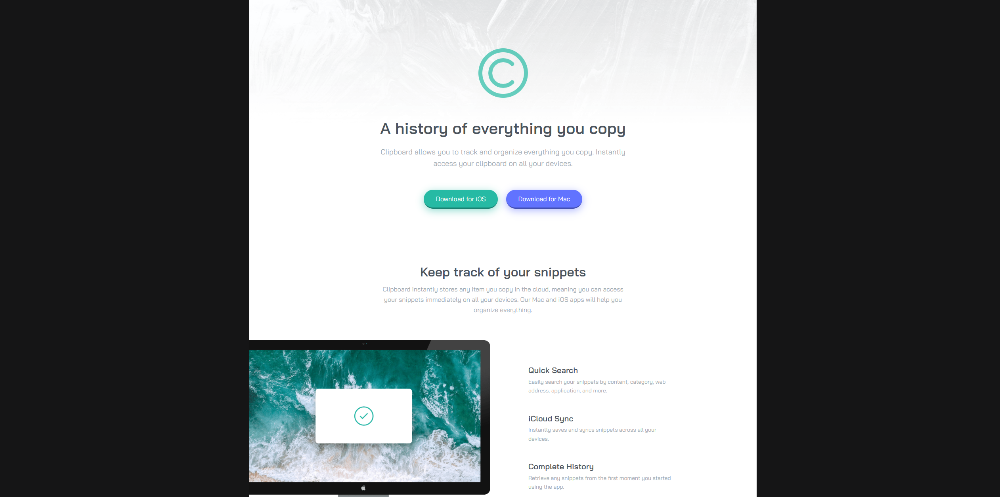

<h1 align="center"> Clipboard Landing Page Challenge </h1>

This is a developmental project that I located on frontendmentor.io. At this point in my journey, I'm mastering JavaScript and React.js. I'm completing these "mini" projects to keep my HTML & CSS sharp.    

## Links

- [Live](https://kris-syevens.github.io/Front-End-Mentor-Challenges/Clipboard-Landing-Page-Challenge)

## Screenshots

## Available Commands

Not Applicable.

## Built With

- HTML
- CSS (Sass)

## Future Updates

- [ ] Correct content layout. Currently too narrow.

## Author

**Kris Syevens**

- [Profile](https://github.com/Kris-Syevens "Kris Syevens")
- [Email](mailto:kris@syevens.com?subject=Hi "Hi!")
- [Website](http://syevens.com "Welcome")

## 🤝 Support

Contributions, issues, and feature requests are welcome!

Give a ⭐️ if you like this project!
