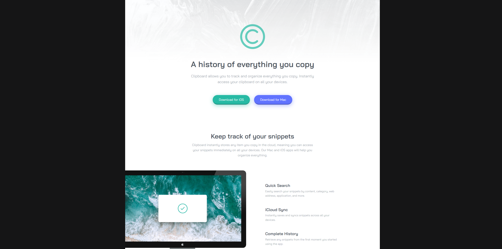

<h1 align="center">Clipboard Style Single Page</h1>

  This is a simple web app that generates random colors in the form of either simple CSS names or HEX code.
    

## Links

- [Live](https://kris-syevens.github.io/Front-End-Mentor-Challenges/Clipboard-Landing-Page-Challenge)

## Screenshots

## Available Commands

Not Applicable.

## Built With

- HTML
- CSS (Sass)

## Future Updates

- [ ] Correct content layout. Currently too narrow.

## Author

**Kris Syevens**

- [Profile](https://github.com/Kris-Syevens "Kris Syevens")
- [Email](mailto:kris@syevens.com?subject=Hi "Hi!")
- [Website](https://syevens.com "Welcome")

## 🤝 Support

Contributions, issues, and feature requests are welcome!

Give a ⭐️ if you like this project!
