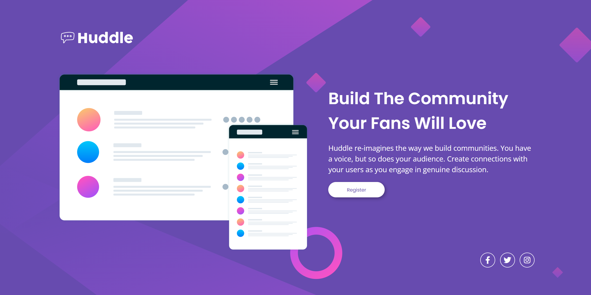

<h1 align="center">Huddle Landing Page</h1>

  This is a developmental project that I located on front end mentor. At this point in my journey, I'm learning JavaScript and React.js. I'm completing these "mini" projects to keep my HTML & CSS sharp.
This was a challenge to create a single page site using HTML & CSS only. I completed this project with relative ease.
If there are any suggestions on how I can improve my code or if you have any questions for me, please feel free to email me.
    

## Links

- [Live](https://kris-syevens.github.io/Huddle)

## Screenshots

## Available Commands

Not Applicable.

## Built With

- HTML
- CSS

## Future Updates

- None planned at this time.

## Author

**Kris Syevens**

- [Profile](https://github.com/Kris-Syevens "Kris Syevens")
- [Email](mailto:kris@syevens.com?subject=Hi "Hi!")
- [Website](https://syevens.com "Welcome")

## 🤝 Support

Contributions, issues, and feature requests are welcome!

Give a ⭐️ if you like this project!

